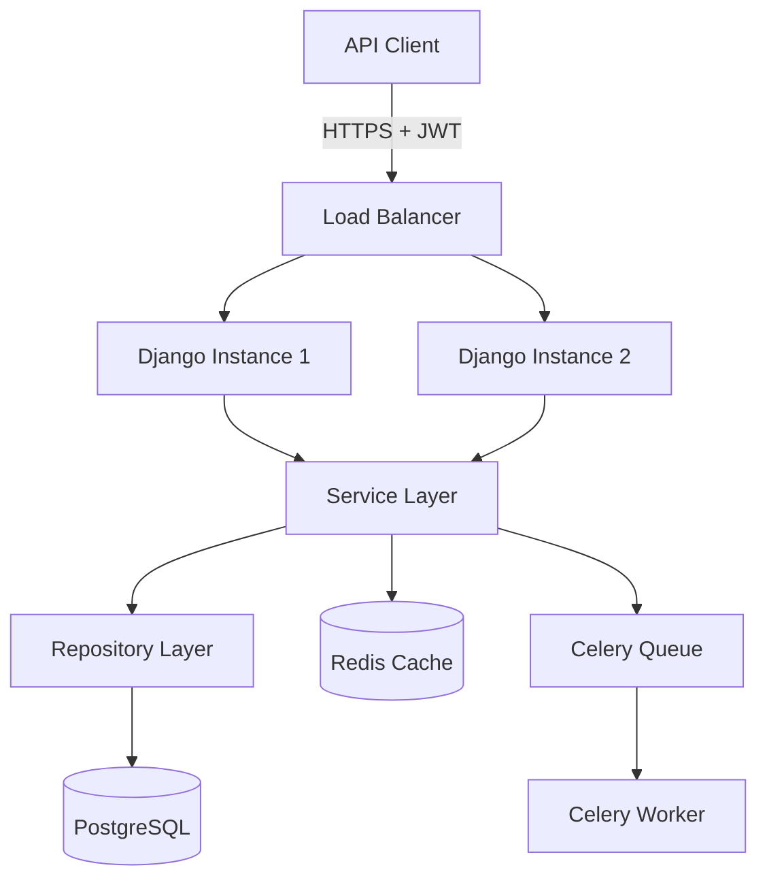
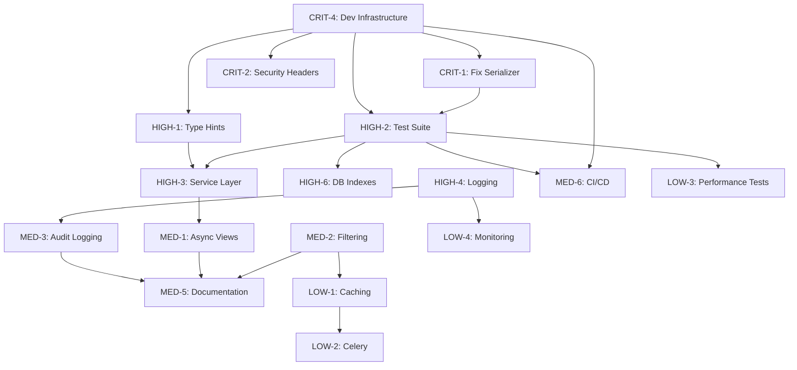

# Django Financial API - Upgrade Roadmap

**Version**: 1.0
**Created**: October 25, 2025
**Target Completion**: 4-6 weeks
**Last Updated**: October 25, 2025

---

## Table of Contents
1. [Overview](#overview)
2. [Priority Matrix](#priority-matrix)
3. [Task Catalog](#task-catalog)
4. [Phase-by-Phase Execution Plan](#phase-by-phase-execution-plan)
5. [Dependencies Graph](#dependencies-graph)
6. [Resource Requirements](#resource-requirements)
7. [Risk Assessment](#risk-assessment)

---

## Overview

This roadmap transforms the Django Financial API from a **functional MVP** to an **enterprise-grade FinTech platform** meeting industry standards for security, performance, testing, and maintainability.

### Objectives
- Achieve **95%+ test coverage** with comprehensive TDD
- Implement **100% type hint coverage** with mypy strict mode
- Establish **world-class documentation** (code, API, architecture)
- Reach **security score >8/10** (OWASP compliance)
- Implement **modern Django patterns** (async, services, repositories)
- Setup **complete DevOps pipeline** (CI/CD, pre-commit hooks)

### Success Metrics
| Metric | Current | Target | Timeline |
|--------|---------|--------|----------|
| Test Coverage | ~10% | 95%+ | Week 2 |
| Type Hints | 0% | 100% | Week 1 |
| Security Score | 5.2/10 | 8.5/10 | Week 2 |
| Documentation | 23% | 85%+ | Week 3 |
| Code Quality | 4.5/10 | 9/10 | Week 4 |

---

## Priority Matrix

### Legend
- 🔴 **CRITICAL**: Security vulnerabilities, blocking issues (Start immediately)
- 🟠 **HIGH**: Core functionality, best practices (Week 1-2)
- 🟡 **MEDIUM**: Enhancements, optimizations (Week 3-4)
- 🟢 **LOW**: Nice-to-have, future improvements (Month 2+)

### Prioritization Criteria
1. **Security Impact**: Does it fix a vulnerability?
2. **User Impact**: Does it affect API consumers?
3. **Developer Experience**: Does it improve development workflow?
4. **Effort vs. Value**: Quick wins prioritized
5. **Dependencies**: Blocking other tasks?

---

## Task Catalog

### 🔴 CRITICAL Priority (Week 1, Days 1-3)

#### CRIT-1: Fix Serializer Security Vulnerability
**Priority**: 🔴 CRITICAL
**Effort**: 30 minutes
**Impact**: Prevents transaction ownership hijacking
**Dependencies**: None
**Risk**: HIGH - Active security vulnerability

**Tasks**:
1. Update `TransactionSerializer` to use explicit fields
2. Set `user` as read-only field
3. Override `create()` to auto-assign `request.user`
4. Add validation tests

**Files Modified**:
- [api/serializers.py](../api/serializers.py)
- [api/tests.py](../api/tests.py)

**Acceptance Criteria**:
- [ ] User field is read-only in serializer
- [ ] Create method auto-assigns authenticated user
- [ ] Test verifies user cannot hijack other user's ID
- [ ] All existing tests pass

---

#### CRIT-2: Add Security Headers
**Priority**: 🔴 CRITICAL
**Effort**: 1 hour
**Impact**: Protects against XSS, clickjacking, MITM attacks
**Dependencies**: None
**Risk**: MEDIUM - Security hardening

**Tasks**:
1. Add security middleware configuration to settings
2. Configure HTTPS enforcement (production)
3. Set secure cookie flags
4. Add HSTS headers
5. Configure CSP headers

**Files Modified**:
- [config/settings.py](../config/settings.py)

**Settings to Add**:
```python
# Security Headers
SECURE_HSTS_SECONDS = 31536000
SECURE_HSTS_INCLUDE_SUBDOMAINS = True
SECURE_HSTS_PRELOAD = True
SECURE_SSL_REDIRECT = True  # Production only
SESSION_COOKIE_SECURE = True
CSRF_COOKIE_SECURE = True
SECURE_BROWSER_XSS_FILTER = True
SECURE_CONTENT_TYPE_NOSNIFF = True
X_FRAME_OPTIONS = 'DENY'
```

**Acceptance Criteria**:
- [ ] Security headers present in response
- [ ] HTTPS redirect enabled (production)
- [ ] Cookies marked secure
- [ ] Security scan passes (bandit)

---

#### CRIT-3: Remove Insecure SECRET_KEY Fallback
**Priority**: 🔴 CRITICAL
**Effort**: 15 minutes
**Impact**: Prevents production deployment with weak secrets
**Dependencies**: CRIT-4 (Create .env.example)
**Risk**: LOW - Simple validation

**Tasks**:
1. Remove fallback from `SECRET_KEY`
2. Add validation to raise exception if not set
3. Document in README
4. Create .env.example

**Files Modified**:
- [config/settings.py](../config/settings.py)
- [.env.example](../.env.example) (NEW)
- [README.md](../README.md)

**Code Change**:
```python
# Before:
SECRET_KEY = os.getenv("SECRET_KEY", "fallback-secret-key")

# After:
SECRET_KEY = os.getenv("SECRET_KEY")
if not SECRET_KEY:
    raise ImproperlyConfigured("SECRET_KEY environment variable must be set")
```

**Acceptance Criteria**:
- [ ] App fails to start if SECRET_KEY not set
- [ ] .env.example includes SECRET_KEY with instructions
- [ ] README documents environment variable setup

---

#### CRIT-4: Setup Development Infrastructure
**Priority**: 🔴 CRITICAL
**Effort**: 3 hours
**Impact**: Enables automated code quality checks
**Dependencies**: None (enables all other tasks)
**Risk**: LOW - Well-established tools

**Tasks**:
1. Create `pyproject.toml` with tool configurations
2. Create `.pre-commit-config.yaml`
3. Create `pytest.ini`
4. Create `Makefile` with common commands
5. Split requirements into base/dev/test/prod
6. Install and test all tools

**Files Created**:
- [pyproject.toml](../pyproject.toml) (NEW)
- [.pre-commit-config.yaml](../.pre-commit-config.yaml) (NEW)
- [pytest.ini](../pytest.ini) (NEW)
- [Makefile](../Makefile) (NEW)
- [requirements/base.txt](../requirements/base.txt) (NEW)
- [requirements/development.txt](../requirements/development.txt) (NEW)
- [requirements/testing.txt](../requirements/testing.txt) (NEW)
- [requirements/production.txt](../requirements/production.txt) (NEW)

**Tools to Configure**:
- **Black**: Code formatting (line-length=88)
- **isort**: Import sorting (profile=black)
- **flake8**: Linting (max-line-length=88)
- **mypy**: Type checking (strict mode)
- **bandit**: Security scanning
- **pytest**: Testing framework
- **coverage**: Code coverage (target=95%)

**Acceptance Criteria**:
- [ ] `make install` installs all dependencies
- [ ] `make format` formats code with black+isort
- [ ] `make lint` runs flake8+mypy+bandit
- [ ] `make test` runs pytest with coverage
- [ ] Pre-commit hooks run on git commit
- [ ] All tools pass on current codebase (after fixes)

---

### 🟠 HIGH Priority (Week 1, Days 4-7)

#### HIGH-1: Add Comprehensive Type Hints
**Priority**: 🟠 HIGH
**Effort**: 4 hours
**Impact**: Enables static type checking, improves IDE support
**Dependencies**: CRIT-4 (mypy configuration)
**Risk**: LOW - Non-breaking change

**Tasks**:
1. Add type hints to all function signatures
2. Add type hints to class attributes
3. Create custom types in `core/types.py`
4. Configure mypy in strict mode
5. Fix all mypy errors

**Files Modified**:
- [api/models.py](../api/models.py)
- [api/views.py](../api/views.py)
- [api/serializers.py](../api/serializers.py)
- [api/urls.py](../api/urls.py)
- [api/admin.py](../api/admin.py)
- [api/throttling.py](../api/throttling.py)
- [api/tests.py](../api/tests.py)
- [config/settings.py](../config/settings.py)
- [config/urls.py](../config/urls.py)
- [core/types.py](../core/types.py) (NEW)

**Example Changes**:
```python
# Before:
def get_queryset(self):
    return Transaction.objects.filter(user=self.request.user)

# After:
def get_queryset(self) -> QuerySet[Transaction]:
    return Transaction.objects.filter(user=self.request.user)
```

**Acceptance Criteria**:
- [ ] All functions have return type hints
- [ ] All function parameters have type hints
- [ ] Complex types defined in core/types.py
- [ ] `mypy --strict` passes with 0 errors
- [ ] IDE autocomplete works correctly

**Estimated Impact**: 100% type hint coverage

---

#### HIGH-2: Implement Comprehensive Test Suite
**Priority**: 🟠 HIGH
**Effort**: 12 hours
**Impact**: Ensures code correctness, enables refactoring
**Dependencies**: CRIT-4 (pytest setup)
**Risk**: LOW - Pure addition

**Tasks**:
1. Create test infrastructure (conftest.py, factories)
2. Write model tests (validation, methods)
3. Write serializer tests (validation, fields)
4. Write ViewSet tests (CRUD, permissions, throttling)
5. Write integration tests (end-to-end flows)
6. Add edge case and error condition tests

**Files Created/Modified**:
- [tests/conftest.py](../tests/conftest.py) (NEW)
- [tests/factories/user_factory.py](../tests/factories/user_factory.py) (NEW)
- [tests/factories/transaction_factory.py](../tests/factories/transaction_factory.py) (NEW)
- [tests/unit/test_models.py](../tests/unit/test_models.py) (NEW)
- [tests/unit/test_serializers.py](../tests/unit/test_serializers.py) (NEW)
- [tests/unit/test_views.py](../tests/unit/test_views.py) (NEW)
- [tests/integration/test_transaction_flow.py](../tests/integration/test_transaction_flow.py) (NEW)
- [tests/integration/test_authentication.py](../tests/integration/test_authentication.py) (NEW)

**Test Categories**:
1. **Model Tests** (15 tests):
   - Field validation
   - Default values
   - String representations
   - Relationships
   - Custom methods

2. **Serializer Tests** (12 tests):
   - Required fields
   - Read-only fields
   - Data transformation
   - Validation logic
   - Error messages

3. **ViewSet Tests** (25 tests):
   - CRUD operations (create, list, retrieve, update, delete)
   - Permission checks
   - User isolation
   - Throttling
   - Pagination
   - Filtering/ordering
   - Error handling

4. **Integration Tests** (8 tests):
   - Full transaction lifecycle
   - JWT authentication flow
   - Multi-user scenarios
   - Concurrent requests

**Acceptance Criteria**:
- [ ] Test coverage ≥95%
- [ ] All tests pass
- [ ] Tests run in <10 seconds
- [ ] Factory Boy generates realistic test data
- [ ] Edge cases and error conditions covered

**Estimated Impact**: 95%+ test coverage (from ~10%)

---

#### HIGH-3: Implement Service Layer Architecture
**Priority**: 🟠 HIGH
**Effort**: 6 hours
**Impact**: Separates business logic, improves testability
**Dependencies**: HIGH-1 (type hints)
**Risk**: MEDIUM - Requires refactoring

**Tasks**:
1. Create service layer structure
2. Move business logic from views to services
3. Implement repository pattern for data access
4. Update views to use services
5. Update tests for new architecture

**Files Created**:
- [api/services/transaction_service.py](../api/services/transaction_service.py) (NEW)
- [api/repositories/transaction_repository.py](../api/repositories/transaction_repository.py) (NEW)
- [core/services/base_service.py](../core/services/base_service.py) (NEW)
- [core/repositories/base_repository.py](../core/repositories/base_repository.py) (NEW)

**Files Modified**:
- [api/views.py](../api/views.py)
- [api/tests.py](../api/tests.py)

**Architecture Before**:
```
View → Model → Database
```

**Architecture After**:
```
View → Service → Repository → Model → Database
```

**Example Service**:
```python
# api/services/transaction_service.py
from typing import List
from django.contrib.auth.models import User
from api.models import Transaction
from api.repositories.transaction_repository import TransactionRepository

class TransactionService:
    def __init__(self, repository: TransactionRepository):
        self.repository = repository

    def get_user_transactions(self, user: User) -> List[Transaction]:
        """Get all transactions for a user."""
        return self.repository.filter_by_user(user)

    def create_transaction(self, user: User, data: dict) -> Transaction:
        """Create a transaction for a user."""
        # Business logic here
        if data['amount'] <= 0:
            raise ValueError("Amount must be positive")
        data['user'] = user
        return self.repository.create(data)
```

**Acceptance Criteria**:
- [ ] All business logic moved to service layer
- [ ] Views only handle HTTP concerns
- [ ] Repository pattern implemented for data access
- [ ] All tests pass with new architecture
- [ ] Services are easily mockable for testing

---

#### HIGH-4: Add Proper Logging
**Priority**: 🟠 HIGH
**Effort**: 3 hours
**Impact**: Enables debugging and monitoring
**Dependencies**: None
**Risk**: LOW - Pure addition

**Tasks**:
1. Configure Django logging in settings
2. Add structured logging with python-json-logger
3. Add request ID tracking middleware
4. Add logging to service layer
5. Add security event logging

**Files Modified**:
- [config/settings.py](../config/settings.py)
- [core/middleware/request_id.py](../core/middleware/request_id.py) (NEW)
- [api/services/transaction_service.py](../api/services/transaction_service.py)

**Logging Configuration**:
```python
# config/settings.py
LOGGING = {
    'version': 1,
    'disable_existing_loggers': False,
    'formatters': {
        'json': {
            '()': 'pythonjsonlogger.jsonlogger.JsonFormatter',
            'format': '%(asctime)s %(name)s %(levelname)s %(message)s',
        },
    },
    'handlers': {
        'console': {
            'class': 'logging.StreamHandler',
            'formatter': 'json',
        },
        'file': {
            'class': 'logging.handlers.RotatingFileHandler',
            'filename': 'logs/app.log',
            'maxBytes': 10485760,  # 10MB
            'backupCount': 5,
            'formatter': 'json',
        },
    },
    'loggers': {
        'api': {
            'handlers': ['console', 'file'],
            'level': 'INFO',
        },
        'django.security': {
            'handlers': ['console', 'file'],
            'level': 'WARNING',
        },
    },
}
```

**Events to Log**:
- Transaction creation/update/deletion
- Authentication attempts (success/failure)
- Authorization failures
- Throttling events
- Validation errors
- Database query errors

**Acceptance Criteria**:
- [ ] Structured JSON logging configured
- [ ] Request ID tracked across requests
- [ ] All business events logged
- [ ] Security events logged
- [ ] Log rotation configured

---

#### HIGH-5: Configure CORS Properly
**Priority**: 🟠 HIGH
**Effort**: 1 hour
**Impact**: Enables frontend integration
**Dependencies**: None
**Risk**: LOW - Configuration only

**Tasks**:
1. Install django-cors-headers
2. Configure CORS settings
3. Set allowed origins from environment variables
4. Document CORS configuration

**Files Modified**:
- [config/settings.py](../config/settings.py)
- [requirements/base.txt](../requirements/base.txt)
- [.env.example](../.env.example)

**Configuration**:
```python
# Add to INSTALLED_APPS
INSTALLED_APPS = [
    # ...
    'corsheaders',
]

# Add to MIDDLEWARE (before CommonMiddleware)
MIDDLEWARE = [
    'django.middleware.security.SecurityMiddleware',
    'corsheaders.middleware.CorsMiddleware',  # Add this
    'django.middleware.common.CommonMiddleware',
    # ...
]

# CORS settings
CORS_ALLOWED_ORIGINS = os.getenv('CORS_ALLOWED_ORIGINS', '').split(',')
CORS_ALLOW_CREDENTIALS = True
```

**Acceptance Criteria**:
- [ ] CORS headers present in responses
- [ ] Allowed origins configurable via environment
- [ ] Preflight requests handled correctly
- [ ] Credentials allowed when needed

---

#### HIGH-6: Add Database Indexes
**Priority**: 🟠 HIGH
**Effort**: 1 hour
**Impact**: Improves query performance
**Dependencies**: HIGH-2 (tests to verify no breakage)
**Risk**: LOW - Migration only

**Tasks**:
1. Add indexes to Transaction model
2. Create migration
3. Document index strategy
4. Test query performance

**Files Modified**:
- [api/models.py](../api/models.py)
- New migration file

**Indexes to Add**:
```python
# api/models.py
class Transaction(models.Model):
    # ... existing fields ...

    class Meta:
        indexes = [
            models.Index(fields=['user', '-date'], name='user_date_idx'),
            models.Index(fields=['category'], name='category_idx'),
            models.Index(fields=['date'], name='date_idx'),
            models.Index(fields=['user', 'category'], name='user_category_idx'),
        ]
        ordering = ['-date']
```

**Acceptance Criteria**:
- [ ] Indexes created via migration
- [ ] Query performance improved (measure with Django Debug Toolbar)
- [ ] No existing functionality broken
- [ ] Index strategy documented

---

### 🟡 MEDIUM Priority (Week 2-3)

#### MED-1: Implement Async Views
**Priority**: 🟡 MEDIUM
**Effort**: 4 hours
**Impact**: Improves performance for I/O-bound operations
**Dependencies**: HIGH-3 (service layer)
**Risk**: MEDIUM - Requires async knowledge

**Tasks**:
1. Convert TransactionViewSet to async
2. Use async ORM queries
3. Add async tests
4. Benchmark performance improvement

**Files Modified**:
- [api/views.py](../api/views.py)
- [api/services/transaction_service.py](../api/services/transaction_service.py)
- [tests/integration/test_async_performance.py](../tests/integration/test_async_performance.py) (NEW)

**Example Conversion**:
```python
# Before:
class TransactionViewSet(viewsets.ModelViewSet):
    def get_queryset(self):
        return self.service.get_user_transactions(self.request.user)

# After:
class TransactionViewSet(viewsets.ModelViewSet):
    async def aget_queryset(self):
        return await self.service.aget_user_transactions(self.request.user)
```

**Acceptance Criteria**:
- [ ] ViewSet methods use async/await
- [ ] ORM queries use async API
- [ ] Async tests pass
- [ ] Performance benchmark shows improvement

---

#### MED-2: Add Filtering, Pagination, Search
**Priority**: 🟡 MEDIUM
**Effort**: 3 hours
**Impact**: Improves API usability
**Dependencies**: None
**Risk**: LOW - DRF built-in features

**Tasks**:
1. Install django-filter
2. Configure DRF pagination
3. Add filtering on Transaction fields
4. Add search functionality
5. Add ordering options
6. Update API documentation

**Files Modified**:
- [config/settings.py](../config/settings.py)
- [api/views.py](../api/views.py)
- [api/filters.py](../api/filters.py) (NEW)
- [requirements/base.txt](../requirements/base.txt)

**Configuration**:
```python
# config/settings.py
REST_FRAMEWORK = {
    # ... existing ...
    'DEFAULT_PAGINATION_CLASS': 'rest_framework.pagination.PageNumberPagination',
    'PAGE_SIZE': 100,
    'DEFAULT_FILTER_BACKENDS': [
        'django_filters.rest_framework.DjangoFilterBackend',
        'rest_framework.filters.OrderingFilter',
        'rest_framework.filters.SearchFilter',
    ],
}

# api/filters.py
import django_filters
from .models import Transaction

class TransactionFilter(django_filters.FilterSet):
    min_amount = django_filters.NumberFilter(field_name='amount', lookup_expr='gte')
    max_amount = django_filters.NumberFilter(field_name='amount', lookup_expr='lte')
    start_date = django_filters.DateFilter(field_name='date', lookup_expr='gte')
    end_date = django_filters.DateFilter(field_name='date', lookup_expr='lte')

    class Meta:
        model = Transaction
        fields = ['category', 'min_amount', 'max_amount', 'start_date', 'end_date']

# api/views.py
class TransactionViewSet(viewsets.ModelViewSet):
    filterset_class = TransactionFilter
    search_fields = ['description']
    ordering_fields = ['date', 'amount', 'category']
    ordering = ['-date']
```

**API Examples**:
```bash
# Pagination
GET /api/transactions/?page=2&page_size=50

# Filtering
GET /api/transactions/?category=income&min_amount=100&start_date=2025-01-01

# Search
GET /api/transactions/?search=freelance

# Ordering
GET /api/transactions/?ordering=-amount
```

**Acceptance Criteria**:
- [ ] Pagination works on all list endpoints
- [ ] Filtering by date range, amount range, category
- [ ] Search by description
- [ ] Ordering by date, amount, category
- [ ] API documentation reflects new features

---

#### MED-3: Implement Audit Logging
**Priority**: 🟡 MEDIUM
**Effort**: 5 hours
**Impact**: Compliance requirement for FinTech
**Dependencies**: HIGH-4 (logging infrastructure)
**Risk**: MEDIUM - Database design

**Tasks**:
1. Create AuditLog model
2. Create audit logging middleware/signals
3. Add audit decorators for sensitive operations
4. Create audit log API endpoints (read-only)
5. Add audit log tests

**Files Created**:
- [api/models/audit_log.py](../api/models/audit_log.py) (NEW)
- [core/decorators/audit.py](../core/decorators/audit.py) (NEW)
- [api/views/audit_log_view.py](../api/views/audit_log_view.py) (NEW)

**AuditLog Model**:
```python
# api/models/audit_log.py
from django.db import models
from django.contrib.auth.models import User

class AuditLog(models.Model):
    ACTION_CHOICES = [
        ('create', 'Create'),
        ('update', 'Update'),
        ('delete', 'Delete'),
        ('read', 'Read'),
    ]

    user = models.ForeignKey(User, on_delete=models.SET_NULL, null=True)
    action = models.CharField(max_length=10, choices=ACTION_CHOICES)
    model_name = models.CharField(max_length=100)
    object_id = models.IntegerField()
    changes = models.JSONField(default=dict)
    ip_address = models.GenericIPAddressField()
    user_agent = models.TextField()
    timestamp = models.DateTimeField(auto_now_add=True)

    class Meta:
        indexes = [
            models.Index(fields=['user', '-timestamp']),
            models.Index(fields=['model_name', 'object_id']),
        ]
        ordering = ['-timestamp']
```

**Decorator Usage**:
```python
# api/services/transaction_service.py
from core.decorators.audit import audit_log

class TransactionService:
    @audit_log(action='create', model_name='Transaction')
    def create_transaction(self, user: User, data: dict) -> Transaction:
        # ...
```

**Acceptance Criteria**:
- [ ] All CRUD operations logged to AuditLog
- [ ] IP address and user agent captured
- [ ] Changes tracked (before/after state)
- [ ] Audit logs queryable via API
- [ ] Audit logs immutable (read-only)
- [ ] Tests verify audit logging works

---

#### MED-4: Add Internationalization (i18n)
**Priority**: 🟡 MEDIUM
**Effort**: 6 hours
**Impact**: Supports multilingual requirement (Persian, English, Arabic, Turkish)
**Dependencies**: None
**Risk**: MEDIUM - Translation effort

**Tasks**:
1. Configure Django i18n settings
2. Mark all strings for translation
3. Create translation files for each language
4. Add language detection middleware
5. Test with all supported languages

**Files Modified**:
- [config/settings.py](../config/settings.py)
- [api/models.py](../api/models.py)
- [api/serializers.py](../api/serializers.py)
- Multiple `.po` files in locale/

**Configuration**:
```python
# config/settings.py
LANGUAGE_CODE = 'en-us'
LANGUAGES = [
    ('en', 'English'),
    ('fa', 'Persian'),
    ('ar', 'Arabic'),
    ('tr', 'Turkish'),
]
LOCALE_PATHS = [BASE_DIR / 'locale']
USE_I18N = True
USE_L10N = True

MIDDLEWARE = [
    # ...
    'django.middleware.locale.LocaleMiddleware',
]
```

**Translation Process**:
```bash
# Generate translation files
python manage.py makemessages -l fa
python manage.py makemessages -l ar
python manage.py makemessages -l tr

# Compile translations
python manage.py compilemessages
```

**Acceptance Criteria**:
- [ ] All user-facing strings marked for translation
- [ ] Translation files created for 4 languages
- [ ] Language selection via Accept-Language header
- [ ] API errors returned in correct language
- [ ] RTL support for Arabic/Persian

---

#### MED-5: Create Comprehensive Documentation
**Priority**: 🟡 MEDIUM
**Effort**: 8 hours
**Impact**: Developer onboarding, maintainability
**Dependencies**: All above tasks (documents final state)
**Risk**: LOW - Writing only

**Tasks**:
1. Create architecture documentation
2. Create API usage guides
3. Create development guides
4. Create deployment guides
5. Create ADRs (Architectural Decision Records)
6. Update README

**Files Created**:
```
docs/
├── architecture/
│   ├── system-overview.md
│   ├── database-schema.md
│   ├── api-design.md
│   ├── security-architecture.md
│   └── diagrams/
│       ├── system-architecture.mmd
│       ├── data-flow.mmd
│       └── deployment.mmd
├── adr/
│   ├── 0001-use-jwt-authentication.md
│   ├── 0002-use-service-layer-pattern.md
│   ├── 0003-use-async-views.md
│   └── template.md
├── development/
│   ├── setup-guide.md
│   ├── testing-guide.md
│   ├── code-style-guide.md
│   └── CONTRIBUTING.md
├── deployment/
│   ├── production-checklist.md
│   ├── docker-deployment.md
│   ├── environment-variables.md
│   └── monitoring-setup.md
└── api/
    ├── authentication.md
    ├── error-handling.md
    ├── rate-limiting.md
    ├── filtering-pagination.md
    └── versioning.md
```

**Key Documentation**:

1. **System Overview** (Mermaid diagram):


2. **CONTRIBUTING.md**:
   - Development setup
   - Branching strategy
   - Commit message format
   - PR process
   - Code review checklist

3. **Production Checklist**:
   - Environment variables verification
   - Database migration process
   - Static files collection
   - SSL certificate setup
   - Monitoring setup
   - Backup strategy

**Acceptance Criteria**:
- [ ] All markdown files follow consistent structure
- [ ] Mermaid diagrams render correctly
- [ ] Code examples tested and working
- [ ] Links between documents work
- [ ] README links to all documentation

---

#### MED-6: Setup CI/CD Pipeline
**Priority**: 🟡 MEDIUM
**Effort**: 4 hours
**Impact**: Automated testing and deployment
**Dependencies**: HIGH-2 (test suite), CRIT-4 (dev infrastructure)
**Risk**: LOW - GitHub Actions

**Tasks**:
1. Create CI workflow (test, lint, type-check)
2. Create security scan workflow
3. Create deployment workflow (staging)
4. Configure branch protection rules
5. Add status badges to README

**Files Created**:
- [.github/workflows/ci.yml](../.github/workflows/ci.yml) (NEW)
- [.github/workflows/security-scan.yml](../.github/workflows/security-scan.yml) (NEW)
- [.github/workflows/deploy-staging.yml](../.github/workflows/deploy-staging.yml) (NEW)

**CI Workflow**:
```yaml
# .github/workflows/ci.yml
name: CI

on:
  push:
    branches: [main, develop]
  pull_request:
    branches: [main, develop]

jobs:
  test:
    runs-on: ubuntu-latest
    steps:
      - uses: actions/checkout@v3
      - name: Set up Python
        uses: actions/setup-python@v4
        with:
          python-version: '3.12'
      - name: Install dependencies
        run: |
          pip install -r requirements/testing.txt
      - name: Run linters
        run: |
          make lint
      - name: Run type checks
        run: |
          make type-check
      - name: Run tests
        run: |
          make test
      - name: Upload coverage
        uses: codecov/codecov-action@v3
```

**Acceptance Criteria**:
- [ ] CI runs on every PR
- [ ] All linters/type-checkers run
- [ ] Tests run with coverage report
- [ ] Security scan runs daily
- [ ] Staging deployment on merge to develop
- [ ] Status badges in README

---

### 🟢 LOW Priority (Month 2+)

#### LOW-1: Implement Caching Strategy
**Priority**: 🟢 LOW
**Effort**: 5 hours
**Impact**: Performance optimization for read-heavy endpoints
**Dependencies**: MED-2 (filtering/pagination)
**Risk**: MEDIUM - Cache invalidation complexity

**Tasks**:
1. Install Redis
2. Configure Django caching
3. Add cache decorators to views
4. Implement cache invalidation on writes
5. Add cache warming for critical data
6. Monitor cache hit rates

**Files Modified**:
- [config/settings.py](../config/settings.py)
- [api/views.py](../api/views.py)
- [core/cache/cache_manager.py](../core/cache/cache_manager.py) (NEW)
- [docker-compose.yml](../docker-compose.yml)

**Configuration**:
```python
# config/settings.py
CACHES = {
    'default': {
        'BACKEND': 'django_redis.cache.RedisCache',
        'LOCATION': os.getenv('REDIS_URL', 'redis://127.0.0.1:6379/1'),
        'OPTIONS': {
            'CLIENT_CLASS': 'django_redis.client.DefaultClient',
        },
        'KEY_PREFIX': 'financial_api',
        'TIMEOUT': 300,  # 5 minutes
    }
}
```

**Caching Strategy**:
- **List views**: Cache for 5 minutes, invalidate on create/update/delete
- **Detail views**: Cache for 10 minutes, invalidate on update/delete
- **Aggregations**: Cache for 1 hour, invalidate on any transaction change
- **User-specific caching**: Include user ID in cache key

**Acceptance Criteria**:
- [ ] Redis running in docker-compose
- [ ] Cache configured for read endpoints
- [ ] Cache invalidation on writes
- [ ] Cache hit rate >70%
- [ ] Response time improved by >50%

---

#### LOW-2: Setup Celery for Async Tasks
**Priority**: 🟢 LOW
**Effort**: 6 hours
**Impact**: Enables background processing (reports, emails)
**Dependencies**: LOW-1 (Redis)
**Risk**: MEDIUM - Infrastructure complexity

**Tasks**:
1. Install Celery with Redis broker
2. Configure Celery in Django
3. Create tasks for report generation
4. Create periodic tasks for cleanup
5. Add task monitoring (Flower)

**Files Created**:
- [config/celery.py](../config/celery.py) (NEW)
- [api/tasks/report_tasks.py](../api/tasks/report_tasks.py) (NEW)
- [api/tasks/cleanup_tasks.py](../api/tasks/cleanup_tasks.py) (NEW)

**Example Tasks**:
```python
# api/tasks/report_tasks.py
from celery import shared_task

@shared_task
def generate_monthly_report(user_id: int, month: int, year: int):
    """Generate monthly transaction report for user."""
    # Heavy processing here
    pass

@shared_task
def send_transaction_notification(transaction_id: int):
    """Send email notification for new transaction."""
    # Email sending here
    pass
```

**Periodic Tasks**:
```python
# config/celery.py
from celery.schedules import crontab

app.conf.beat_schedule = {
    'cleanup-old-audit-logs': {
        'task': 'api.tasks.cleanup_tasks.cleanup_old_audit_logs',
        'schedule': crontab(hour=2, minute=0),  # 2 AM daily
    },
}
```

**Acceptance Criteria**:
- [ ] Celery workers running
- [ ] Tasks execute asynchronously
- [ ] Periodic tasks run on schedule
- [ ] Flower monitoring accessible
- [ ] Task failures logged and retried

---

#### LOW-3: Add Performance Tests
**Priority**: 🟢 LOW
**Effort**: 4 hours
**Impact**: Baseline for performance monitoring
**Dependencies**: HIGH-2 (test infrastructure)
**Risk**: LOW - Benchmarking only

**Tasks**:
1. Create performance test suite with pytest-benchmark
2. Add query count tests (detect N+1)
3. Add response time benchmarks
4. Add load tests with Locust
5. Document performance baselines

**Files Created**:
- [tests/performance/test_query_performance.py](../tests/performance/test_query_performance.py) (NEW)
- [tests/performance/test_response_time.py](../tests/performance/test_response_time.py) (NEW)
- [tests/performance/locustfile.py](../tests/performance/locustfile.py) (NEW)

**Example Performance Test**:
```python
# tests/performance/test_query_performance.py
import pytest
from django.test.utils import override_settings
from django.db import connection
from django.test import RequestFactory

@pytest.mark.django_db
def test_transaction_list_query_count(user, transaction_factory):
    """Ensure transaction list view executes minimal queries."""
    # Create test data
    transaction_factory.create_batch(100, user=user)

    # Test query count
    factory = RequestFactory()
    request = factory.get('/api/transactions/')
    request.user = user

    with override_settings(DEBUG=True):
        queries_before = len(connection.queries)
        response = TransactionViewSet.as_view({'get': 'list'})(request)
        queries_after = len(connection.queries)

    query_count = queries_after - queries_before
    assert query_count <= 3, f"Expected ≤3 queries, got {query_count}"
```

**Load Test Scenario**:
```python
# tests/performance/locustfile.py
from locust import HttpUser, task, between

class FinancialAPIUser(HttpUser):
    wait_time = between(1, 3)

    def on_start(self):
        # Login and get JWT token
        response = self.client.post("/api/token/", {
            "username": "testuser",
            "password": "testpass"
        })
        self.token = response.json()["access"]

    @task(3)
    def list_transactions(self):
        self.client.get(
            "/api/transactions/",
            headers={"Authorization": f"Bearer {self.token}"}
        )

    @task(1)
    def create_transaction(self):
        self.client.post(
            "/api/transactions/",
            json={"amount": 100, "category": "income"},
            headers={"Authorization": f"Bearer {self.token}"}
        )
```

**Baselines to Establish**:
- List endpoint: <200ms (100 records)
- Detail endpoint: <50ms
- Create endpoint: <100ms
- Query count: ≤3 queries per list request

**Acceptance Criteria**:
- [ ] Query count tests pass
- [ ] Response time benchmarks established
- [ ] Load tests run successfully
- [ ] Performance baselines documented

---

#### LOW-4: Add Monitoring and Error Tracking
**Priority**: 🟢 LOW
**Effort**: 3 hours
**Impact**: Production observability
**Dependencies**: HIGH-4 (logging)
**Risk**: LOW - Integration only

**Tasks**:
1. Integrate Sentry for error tracking
2. Add health check endpoints
3. Add Prometheus metrics
4. Create monitoring dashboard
5. Set up alerts

**Files Modified**:
- [config/settings.py](../config/settings.py)
- [api/views/health_check.py](../api/views/health_check.py) (NEW)
- [config/urls.py](../config/urls.py)

**Sentry Integration**:
```python
# config/settings.py
import sentry_sdk
from sentry_sdk.integrations.django import DjangoIntegration

sentry_sdk.init(
    dsn=os.getenv('SENTRY_DSN'),
    integrations=[DjangoIntegration()],
    traces_sample_rate=0.1,
    send_default_pii=False,
    environment=os.getenv('ENVIRONMENT', 'development'),
)
```

**Health Check Endpoint**:
```python
# api/views/health_check.py
from rest_framework.decorators import api_view, permission_classes
from rest_framework.permissions import AllowAny
from rest_framework.response import Response
from django.db import connection

@api_view(['GET'])
@permission_classes([AllowAny])
def health_check(request):
    """Health check endpoint for load balancers."""
    try:
        # Check database
        connection.ensure_connection()
        db_status = "healthy"
    except Exception:
        db_status = "unhealthy"

    return Response({
        "status": "healthy" if db_status == "healthy" else "unhealthy",
        "database": db_status,
    })
```

**Acceptance Criteria**:
- [ ] Sentry captures errors
- [ ] Health check endpoint returns 200
- [ ] Prometheus metrics exposed
- [ ] Dashboard shows key metrics
- [ ] Alerts configured for critical errors

---

#### LOW-5: Implement Advanced Security Features
**Priority**: 🟢 LOW
**Effort**: 8 hours
**Impact**: Enhanced security (MFA, API keys, request signing)
**Dependencies**: All security tasks
**Risk**: HIGH - Complex implementation

**Tasks**:
1. Add multi-factor authentication (MFA)
2. Implement API key authentication
3. Add request signature validation
4. Implement rate limiting per endpoint
5. Add IP whitelisting

**Files Created**:
- [api/authentication/mfa.py](../api/authentication/mfa.py) (NEW)
- [api/authentication/api_key.py](../api/authentication/api_key.py) (NEW)
- [api/models/api_key.py](../api/models/api_key.py) (NEW)
- [core/security/request_signature.py](../core/security/request_signature.py) (NEW)

**MFA Implementation**:
```python
# api/authentication/mfa.py
from django_otp.plugins.otp_totp.models import TOTPDevice

class MFAAuthentication:
    def verify_mfa(self, user, token):
        device = TOTPDevice.objects.filter(user=user, confirmed=True).first()
        if device and device.verify_token(token):
            return True
        return False
```

**API Key Model**:
```python
# api/models/api_key.py
from django.db import models
from django.contrib.auth.models import User
import secrets

class APIKey(models.Model):
    user = models.ForeignKey(User, on_delete=models.CASCADE)
    key = models.CharField(max_length=64, unique=True)
    name = models.CharField(max_length=100)
    created_at = models.DateTimeField(auto_now_add=True)
    last_used_at = models.DateTimeField(null=True)
    is_active = models.BooleanField(default=True)

    def save(self, *args, **kwargs):
        if not self.key:
            self.key = secrets.token_urlsafe(48)
        super().save(*args, **kwargs)
```

**Acceptance Criteria**:
- [ ] MFA setup and verification working
- [ ] API keys can be generated and used
- [ ] Request signatures validated
- [ ] Per-endpoint rate limiting configured
- [ ] IP whitelisting functional

---

## Phase-by-Phase Execution Plan

### Phase 1: Critical Security & Infrastructure (Week 1, Days 1-3)
**Objective**: Fix security vulnerabilities, establish development workflow

**Tasks** (in order):
1. ✅ CRIT-4: Setup Development Infrastructure (3h)
   - Create pyproject.toml, .pre-commit-config.yaml, pytest.ini, Makefile
   - Split requirements files
   - Install and configure tools

2. ✅ CRIT-1: Fix Serializer Security Vulnerability (30m)
   - Update TransactionSerializer
   - Add tests

3. ✅ CRIT-2: Add Security Headers (1h)
   - Configure settings.py

4. ✅ CRIT-3: Remove Insecure SECRET_KEY Fallback (15m)
   - Add validation
   - Create .env.example

**Deliverables**:
- Working pre-commit hooks
- All linters/formatters configured
- Security vulnerability fixed
- .env.example file

**Success Criteria**:
- `make lint` passes
- `make test` passes
- Security scan shows no CRITICAL issues

**Total Time**: ~5 hours

---

### Phase 2: Code Quality & Testing (Week 1, Days 4-7)
**Objective**: Achieve 95% test coverage, 100% type hints

**Tasks** (in order):
1. ✅ HIGH-1: Add Comprehensive Type Hints (4h)
   - Add type hints to all files
   - Create core/types.py
   - Fix mypy errors

2. ✅ HIGH-2: Implement Comprehensive Test Suite (12h)
   - Create test infrastructure
   - Write model, serializer, view tests
   - Write integration tests
   - Achieve 95% coverage

**Deliverables**:
- 100% type hint coverage
- 95%+ test coverage
- Passing mypy checks

**Success Criteria**:
- `mypy --strict` passes
- Coverage report shows >95%
- All tests pass in <10s

**Total Time**: ~16 hours (~2 days)

---

### Phase 3: Architecture & Best Practices (Week 2, Days 1-4)
**Objective**: Implement service layer, logging, CORS, database optimization

**Tasks** (in order):
1. ✅ HIGH-3: Implement Service Layer Architecture (6h)
   - Create service and repository layers
   - Refactor views
   - Update tests

2. ✅ HIGH-4: Add Proper Logging (3h)
   - Configure structured logging
   - Add request ID tracking
   - Log business events

3. ✅ HIGH-5: Configure CORS Properly (1h)
   - Install django-cors-headers
   - Configure settings

4. ✅ HIGH-6: Add Database Indexes (1h)
   - Add indexes to Transaction model
   - Create migration

**Deliverables**:
- Service layer implemented
- Structured logging configured
- CORS configured
- Database indexes added

**Success Criteria**:
- Business logic in service layer
- All requests have request ID
- CORS headers present
- Query performance improved

**Total Time**: ~11 hours (~1.5 days)

---

### Phase 4: API Enhancements (Week 2, Days 5-7)
**Objective**: Improve API usability with filtering, pagination, async

**Tasks** (in order):
1. ✅ MED-1: Implement Async Views (4h)
   - Convert to async ViewSet
   - Add async tests
   - Benchmark performance

2. ✅ MED-2: Add Filtering, Pagination, Search (3h)
   - Install django-filter
   - Configure DRF settings
   - Add filters, search, ordering

**Deliverables**:
- Async views implemented
- Filtering, pagination, search working

**Success Criteria**:
- Async views faster than sync
- Filtering by all major fields
- Pagination on all list endpoints

**Total Time**: ~7 hours (~1 day)

---

### Phase 5: Compliance & Monitoring (Week 3, Days 1-3)
**Objective**: Add audit logging, i18n, monitoring

**Tasks** (in order):
1. ✅ MED-3: Implement Audit Logging (5h)
   - Create AuditLog model
   - Add audit decorators
   - Create audit API

2. ✅ MED-4: Add Internationalization (6h)
   - Configure i18n
   - Create translation files
   - Test all languages

**Deliverables**:
- Audit logging for all CRUD operations
- i18n support for 4 languages

**Success Criteria**:
- All changes logged to AuditLog
- API responses in correct language

**Total Time**: ~11 hours (~1.5 days)

---

### Phase 6: Documentation & CI/CD (Week 3, Days 4-7)
**Objective**: Complete documentation, automate workflows

**Tasks** (in order):
1. ✅ MED-5: Create Comprehensive Documentation (8h)
   - Architecture docs
   - API guides
   - Development guides
   - ADRs

2. ✅ MED-6: Setup CI/CD Pipeline (4h)
   - Create GitHub Actions workflows
   - Configure branch protection
   - Add status badges

**Deliverables**:
- Complete documentation suite
- Automated CI/CD pipeline

**Success Criteria**:
- All docs sections complete
- CI runs on every PR
- Deployment to staging works

**Total Time**: ~12 hours (~1.5 days)

---

### Phase 7: Performance & Scaling (Week 4 & Beyond)
**Objective**: Optimize performance, add caching, async tasks

**Tasks** (as time permits):
1. LOW-1: Implement Caching Strategy (5h)
2. LOW-2: Setup Celery for Async Tasks (6h)
3. LOW-3: Add Performance Tests (4h)
4. LOW-4: Add Monitoring and Error Tracking (3h)
5. LOW-5: Implement Advanced Security Features (8h)

**Total Time**: ~26 hours (~3-4 days)

---

## Dependencies Graph



**Critical Path**: CRIT-4 → HIGH-1 → HIGH-3 → MED-1 → MED-5 (longest sequence)

---

## Resource Requirements

### Personnel
**Recommended Team**:
- 1 Senior Django Developer (full-time, 4-6 weeks)
- 1 DevOps Engineer (part-time, 1-2 weeks for CI/CD, Docker, monitoring)
- 1 Technical Writer (part-time, 1 week for documentation)

**Alternative (Solo Developer)**:
- Extend timeline to 8-10 weeks
- Focus on CRITICAL and HIGH priorities first
- Defer LOW priority items

### Tools & Services (Required)
- GitHub (version control, CI/CD)
- Python 3.12+
- PostgreSQL 15+ (production)
- Redis (for caching, Celery)

### Tools & Services (Optional/Future)
- Sentry (error tracking) - ~$26/month
- AWS/GCP/Azure (hosting) - varies
- Domain + SSL certificate - ~$15/year

### Development Environment
```bash
# Minimum requirements
- CPU: 4 cores
- RAM: 8GB
- Disk: 20GB free space
- OS: Linux, macOS, or WSL2
```

---

## Risk Assessment

### High Risks

#### Risk 1: Service Layer Refactoring Breaks Existing Functionality
**Probability**: Medium
**Impact**: High
**Mitigation**:
- Comprehensive test suite BEFORE refactoring (HIGH-2 before HIGH-3)
- Incremental refactoring (one ViewSet at a time)
- Thorough testing after each change

#### Risk 2: Async Views Introduce Concurrency Bugs
**Probability**: Medium
**Impact**: Medium
**Mitigation**:
- Extensive async testing
- Use proven patterns from Django docs
- Gradual rollout (test in staging first)

#### Risk 3: Timeline Delays Due to Underestimation
**Probability**: High
**Impact**: Medium
**Mitigation**:
- Buffer time (20%) added to estimates
- Focus on CRITICAL/HIGH priorities first
- Defer LOW priority items if needed

### Medium Risks

#### Risk 4: i18n Translation Quality Issues
**Probability**: Medium
**Impact**: Low
**Mitigation**:
- Use professional translation services
- Native speaker review
- Automated translation tools for initial draft

#### Risk 5: CI/CD Pipeline Configuration Issues
**Probability**: Low
**Impact**: Medium
**Mitigation**:
- Use proven GitHub Actions templates
- Test workflows on feature branch first
- Document troubleshooting steps

### Low Risks

#### Risk 6: Performance Tests Show Unacceptable Baseline
**Probability**: Low
**Impact**: High
**Mitigation**:
- Early profiling during development
- Database indexes (HIGH-6) address most issues
- Caching (LOW-1) as fallback

---

## Quick Wins (Recommended Start)

If time is limited, start with these **high-value, low-effort** tasks:

1. **CRIT-4: Dev Infrastructure** (3h) - Enables everything else
2. **CRIT-1: Fix Serializer** (30m) - Critical security fix
3. **CRIT-2: Security Headers** (1h) - Major security improvement
4. **HIGH-1: Type Hints** (4h) - Immediate IDE benefits
5. **HIGH-5: CORS Config** (1h) - Enables frontend development

**Total Time**: ~9.5 hours (1-2 days)
**Impact**: Security vulnerabilities fixed, dev workflow established, type safety enabled

---

## Progress Tracking

### Weekly Milestones

**Week 1**:
- [ ] All CRITICAL tasks complete
- [ ] Type hints at 100%
- [ ] Test coverage at 95%+
- [ ] Security score >7/10

**Week 2**:
- [ ] Service layer implemented
- [ ] Logging configured
- [ ] Async views working
- [ ] Filtering/pagination added

**Week 3**:
- [ ] Audit logging complete
- [ ] i18n support added
- [ ] Documentation at 80%+
- [ ] CI/CD pipeline operational

**Week 4**:
- [ ] Performance tests baseline
- [ ] Caching implemented
- [ ] Monitoring setup
- [ ] Final documentation review

### KPIs

| KPI | Target | Measurement |
|-----|--------|-------------|
| Test Coverage | ≥95% | `make test` coverage report |
| Type Hint Coverage | 100% | `mypy --strict` passes |
| Security Score | ≥8/10 | `bandit` + manual OWASP review |
| Documentation | ≥85% | Checklist completion |
| CI Pass Rate | ≥90% | GitHub Actions success rate |
| Code Quality | ≥9/10 | `radon` complexity + code review |

---

## Post-Upgrade Maintenance

### Ongoing Tasks
1. **Weekly**: Review test coverage, add tests for new features
2. **Bi-weekly**: Update dependencies, run security scans
3. **Monthly**: Review and update documentation
4. **Quarterly**: Performance benchmarking, optimization review

### Continuous Improvement
- Refactor code based on code review findings
- Update ADRs when architectural decisions change
- Improve test suite based on production issues
- Enhance documentation based on user feedback

---

## Appendix

### A. Tool Configuration Cheatsheet

**Black**:
```toml
[tool.black]
line-length = 88
target-version = ['py312']
include = '\.pyi?$'
```

**isort**:
```toml
[tool.isort]
profile = "black"
multi_line_output = 3
include_trailing_comma = true
line_length = 88
```

**mypy**:
```toml
[tool.mypy]
python_version = "3.12"
strict = true
warn_return_any = true
warn_unused_configs = true
disallow_untyped_defs = true
```

**pytest**:
```ini
[pytest]
DJANGO_SETTINGS_MODULE = config.settings
python_files = tests.py test_*.py *_tests.py
addopts = --cov=api --cov-report=html --cov-report=term-missing --cov-fail-under=95
```

### B. Makefile Commands Reference

```makefile
install:        # Install all dependencies
test:           # Run tests with coverage
lint:           # Run flake8, mypy, bandit
format:         # Format code with black, isort
type-check:     # Run mypy
security:       # Run bandit security scan
clean:          # Remove cache files
migrate:        # Run Django migrations
run:            # Start development server
shell:          # Open Django shell
coverage:       # Generate coverage report
```

### C. Git Workflow

**Branch Naming**:
- `feature/TASK-ID-description` (e.g., `feature/HIGH-1-type-hints`)
- `fix/TASK-ID-description` (e.g., `fix/CRIT-1-serializer-security`)
- `docs/description` (e.g., `docs/api-documentation`)

**Commit Message Format**:
```
[TASK-ID] Brief description (50 chars max)

Detailed explanation of changes (if needed).

- Bullet points for multiple changes
- Use imperative mood ("Add" not "Added")

Fixes #issue-number
```

**Example**:
```
[HIGH-1] Add type hints to all API modules

- Add type hints to models.py (Transaction model)
- Add type hints to views.py (TransactionViewSet)
- Add type hints to serializers.py (TransactionSerializer)
- Create core/types.py for custom type aliases
- Configure mypy in strict mode

All mypy checks now pass with 0 errors.
```

---

## Revision History

| Version | Date | Author | Changes |
|---------|------|--------|---------|
| 1.0 | 2025-10-25 | Claude Code Analysis | Initial roadmap created |

---

**Next Steps**:
1. Review this roadmap with team
2. Adjust timeline based on available resources
3. Create GitHub issues for each task
4. Begin with Phase 1 (Critical Security & Infrastructure)
5. Update this document as progress is made

**Questions?** Refer to `docs/current-state-assessment.md` for detailed findings supporting this roadmap.
